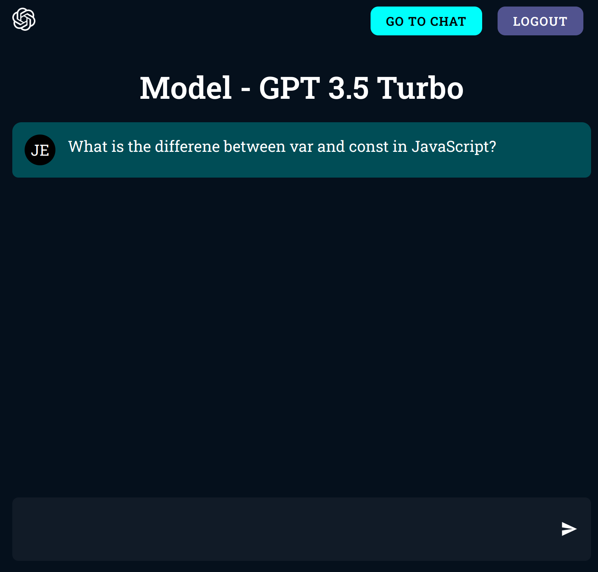

# ChatBot Application

This is a ChatBot built using **Vite**, **React**, **OpenAI GPT-3.5 Turbo**, and **MongoDB**. The ChatBot leverages GPT-3.5 Turbo for natural language understanding and response generation, while MongoDB serves as the database for persistent storage.

<div style="text-align: center;">
    
</div>


## Table of Contents

- [Features](#features)
- [Technologies](#technologies)
- [Getting Started](#getting-started)
- [Prerequisites](#prerequisites)
- [Installation](#installation)
## Features

- Real-time chat interface powered by GPT-3.5 Turbo.
- MongoDB integration for data storage.
- Built with Vite for fast and optimized development.
- Modular, scalable code structure.

## Technologies

- **Frontend:** React, Vite
- **Backend:** OpenAI GPT-3.5 Turbo API, Node.js
- **Database:** MongoDB

## Getting Started

To get a local copy of the project up and running, follow these simple steps.

### Prerequisites

Before you begin, ensure you have the following installed:

- **Node.js**
- **MongoDB** 
- **NPM**
- **OpenAI API Key**

### Installation

1. **Clone the repository**

   ```bash
   git clone git@github.com:sumedhakoranga/myChatBot.git```

2. **Navigate to the project directory**
    ```bash 
    cd myChatBot
    ```

3. **Install dependencies for Backend and Frontend**
    ```bash 
    npm i```

4. **Environment Variables**
    ```
    MONGODB_URL=*****
    PORT=5000
    OPEN_AI_SECRET=*****
    OPENAI_ORAGANIZATION_ID=*****
    JWT_SECRET=*****
    COOKIE_SECRET=******
    ```
5. **Start the development server**
    ```bash
    npm run dev
    ```